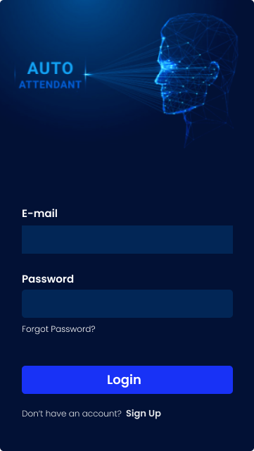
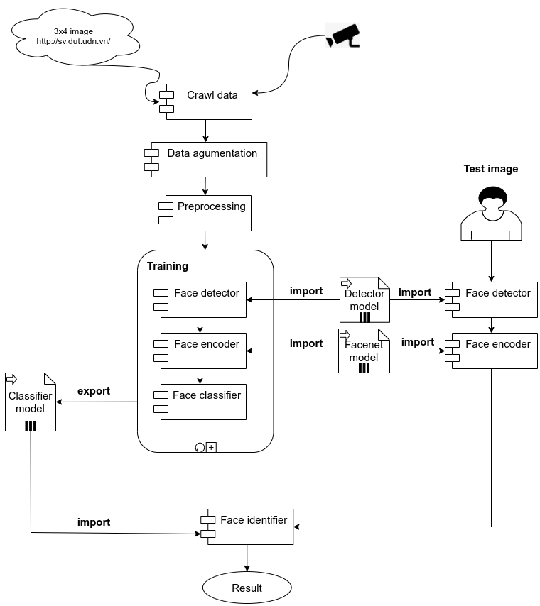
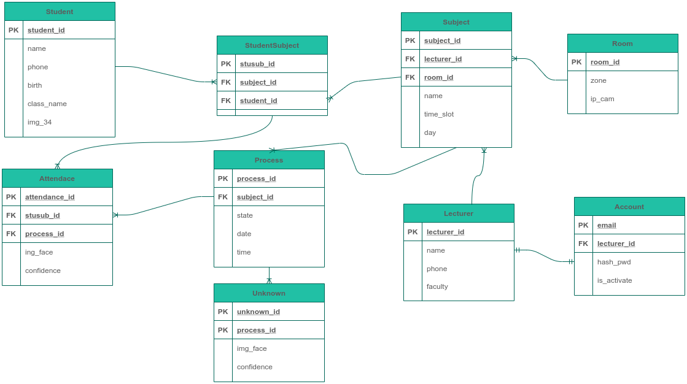
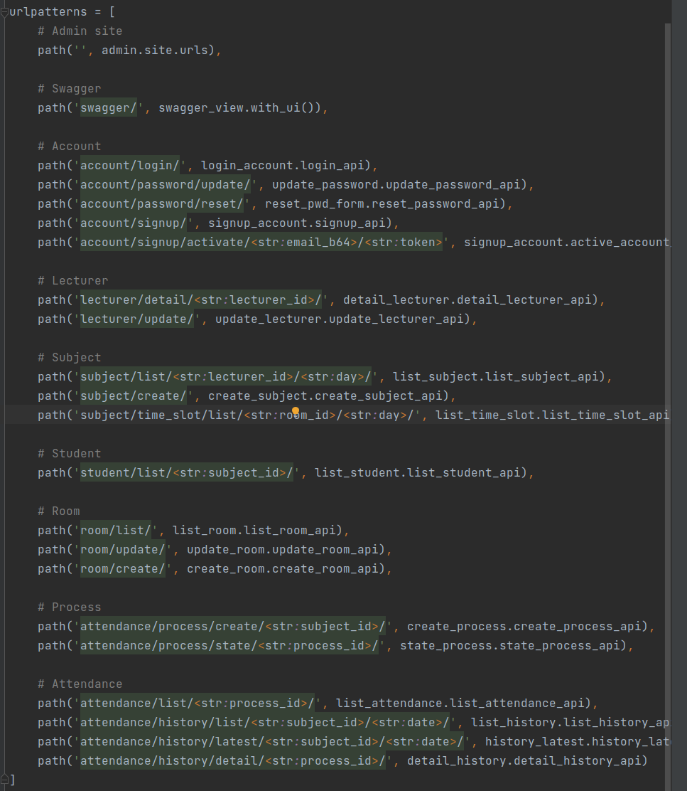
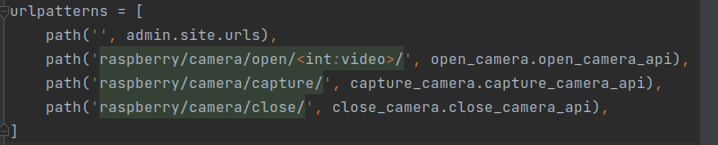

# Automatic Attendance

## How To Build

>### Download source project
```shell 
git clone https://github.com/chautruonglong/NHOM_14.git
```
>### Recognition - Facenet
* Requires:

    ||Linux OS|Window OS|
    |-|-|-|
    |Python|3.6.*|3.6.*|
    |[SVM](https://towardsdatascience.com/support-vector-machine-introduction-to-machine-learning-algorithms-934a444fca47)|||
    |[KNN](https://towardsdatascience.com/machine-learning-basics-with-the-k-nearest-neighbors-algorithm-6a6e71d01761)|||
    |[FAISS](https://towardsdatascience.com/understanding-faiss-619bb6db2d1a)|||

    **Note:** You should use **[Anaconda](https://www.anaconda.com/)** tool to fast setup enviroment

* Move to dir **"NHOM_14/Recogniton-AI/Face-Recognition/"**:

    ```shell 
    cd NHOM_14/Recogniton-AI/Face-Recognition/
    ```

* Crawl data:

    - Using these modules in folder **"NHOM_14/Recogniton-AI/Data-Processing"** to crawl face images
    - Put them in folder **"NHOM_14/Recogniton-AI/Face-Recognition/dataset/raw/"**


* Install packages:

    ```shell 
    pip install -r requirements/requirements_pip.txt
    ```

    ```shell 
    conda install --file requirements/requirements_conda.txt
    ```

* Preprocessing data:

    ```shell 
    python src/preprocessing.py
    ```

* Training Classifier Model:

    ```shell 
    python src/training.py
    ```

* Test:

    |Option|Command|
    |-|-|
    |Webcam|python src/webcam.py<br>python src/webcam_faiss.py|
    |Video|python src/video.py<br>python src/video_faiss.py|
    |Image|python src/image.py<br>python src/image_faiss.py|

>### Server Side - Backend
* Requires:

    ||Linux OS|Window OS|
    |-|-|-|
    |Python|3.6.*|3.6.*|
    |SVM|||
    |KNN|||
    |FAISS|||

    **Note:** You should use **[Anaconda](https://www.anaconda.com/)** tool to fast setup enviroment

* Move to dir **"NHOM_14/Backend-API/backend_api/"**:

    ```shell 
    cd NHOM_14/Backend-API/backend_api/
    ```

* Install packages:

    ```shell 
    pip install -r requirements.txt
    ```

* Run server:

    **Note:** First, create database follow name ***"automatic_attendance"*** using **MySQL** ([XAMPP](https://www.apachefriends.org/download.html) or [Main Website](https://www.mysql.com/downloads/))

    ```shell 
    python manage.py runserver 0.0.0.0:8000
    ```
>### Raspberry (option)
**Note:** [Using SSH protocol to remote raspberry](https://maker.pro/raspberry-pi/projects/how-to-connect-a-raspberry-pi-to-a-laptop-display?fbclid=IwAR0EEwg3AWC5NOeG7EdY3iNKZcjxAk0DsKJtv-ytovtkuSLLCbSQ8mhp_dw)

* Move to dir **"NHOM_14/Raspberry-Camera/raspberry/"**:

    ```shell 
    cd NHOM_14/Raspberry-Camera/raspberry/
    ```

* Install packages:

    ```shell 
    pip install -r requirements.txt
    ```

* Run raspberry server:

    ```shell 
    python manage.py runserver 0.0.0.0:8000
    ```
>### Client Side - Mobile
* Requires:

    |OS|Window OS|
    |-|-|
    |IDEs|Visual Studio 2019|
    |Devices|Virtual Machine or Mobile|
    |Android API|API 27|

* Install [Visual Studio IDE](https://visualstudio.microsoft.com/downloads/):
* Open folder **"NHOM_14/Mobile-App/Mobile/AutoAttendant.sln"** with **Visual Studio IDE**
* Build it on **Virtual Machine** or **Mobile Device**

## System Overview
<p align="center">
    
</p>

## Mobile App

>### Login
<p align="center">
    
</p>

>### Activities
<p align="center">
    
</p>

## Recognition System

<p align="center">
    
</p>

## Database Diagram

<p align="center">
    
</p>

## Server API

<p align="center">
    
</p>


## Raspberry API

<p align="center">
    
</p>

