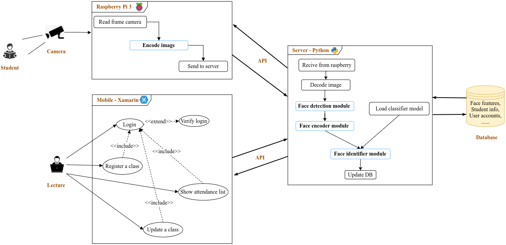

# Automatic Attendance

## System Overview

    

## Mobile App

>#### Login

    

>#### Activities

    

## Recognition System

    

## Database Diagram

    

## Server API

    

## Raspberry API

    

